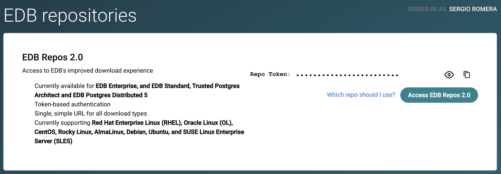

# Transparent Data Encryption demo using EDB Postgres Advanced Server and HashiCorp Vault
This demo will demostrate how to deploy EDB Postgres Advanced Server (EPAS) using Transparent Data Encryption (TDE).

# Prerequisites
- To have an EDB account
- VirtualBox
- Vagrant
- HashiCorp Vault

# Final architecture
You will have to VM's:
- VM 1: EPAS
- VM2: PostgreSQL
# Configuration
The default configuration is (see [vagrant.yaml](./config/vagrant.yaml) file):
```
epas:
  vm_name: epas
  mem_size: 1024
  cpus: 1
  public_ip: 192.168.1.10
  port: 5444

postgres:
  vm_name: postgres
  mem_size: 1024
  cpus: 1
  public_ip: 192.168.1.11
  port: 5432
```

# Configure your credentials
To be able to install EDB Postgres Advanced Server it is necessary to have your credentials configured in the file .edbtoken in your edb directory. You can copy/paste your token from this [URL](https://www.enterprisedb.com/repos-downloads):



```
cat ./edb/.edbtoken
<your_token_here>
```
Once you have the token configured, you can install PostgreSQL, EPAS and test TDE.
# Configure HashiCorp Vault
By default, TDE will use HashiCorp Vault to store keys. There are 2 variables: 
<code>PGDATAKEYWRAPCMD</code> and <code>PGDATAKEYUNWRAPCMD</code> in file [config.sh](./config/config.sh)
```
# TDE Vault config sample
export PGDATAKEYWRAPCMD='base64 | vault write -field=ciphertext transit/encrypt/pg-tde-master-1 plaintext=- > %p'
export PGDATAKEYUNWRAPCMD='vault write -field=plaintext transit/decrypt/pg-tde-master-1 ciphertext=- < %p | base64 -d'
```
# Install PostgreSQL
First of all, install PostgreSQL:
```
# Connect to the postgres VM
vagrant ssh postgres

# You are connected to the linux VM
sudo su - postgres
cd /vagrant_scripts
./install_postgres_cluster.sh
```
The result is:
```
vagrant ssh postgres
Last login: Tue Jul 23 19:19:43 2024 from 10.0.2.2
[vagrant@postgres ~]$ sudo su - postgres
[postgres@postgres ~]$ cd /vagrant_scripts
[postgres@postgres vagrant_scripts]$ ./install_postgres_cluster.sh
The files belonging to this database system will be owned by user "postgres".
This user must also own the server process.

The database cluster will be initialized with locale "en_US.UTF-8".
The default database encoding has accordingly been set to "UTF8".
The default text search configuration will be set to "english".

Data page checksums are disabled.

fixing permissions on existing directory /var/lib/pgsql/16/data ... ok
creating subdirectories ... ok
selecting dynamic shared memory implementation ... posix
selecting default max_connections ... 100
selecting default shared_buffers ... 128MB
selecting default time zone ... UTC
creating configuration files ... ok
running bootstrap script ... ok
performing post-bootstrap initialization ... ok
syncing data to disk ... ok

initdb: warning: enabling "trust" authentication for local connections
initdb: hint: You can change this by editing pg_hba.conf or using the option -A, or --auth-local and --auth-host, the next time you run initdb.

Success. You can now start the database server using:

    /usr/pgsql-16/bin/pg_ctl -D /var/lib/pgsql/16/data -l logfile start

waiting for server to start....2024-07-23 19:21:19.161 UTC [6432] LOG:  redirecting log output to logging collector process
2024-07-23 19:21:19.161 UTC [6432] HINT:  Future log output will appear in directory "log".
 done
server started
[postgres@postgres vagrant_scripts]$
```
# Testing data without encryption
Execute the script ./test_tde.sh
```
./test_tde.sh
```

This test will create a table users with 1 line not encrypted:
```
create table users (
      userid int,
      user_name varchar(10), 
      password varchar(100));

insert into users values (1, 'sergio', 'Thisismypassword01#');
```
And this is the result of the execution:
```
[postgres@postgres vagrant_scripts]$ ./test_tde.sh
NOTICE:  table "users" does not exist, skipping
ERROR:  relation "pg_control_init" does not exist
LINE 1: select data_encryption_version from pg_control_init;
                                            ^
tde_pgdata: /var/lib/pgsql/16/data
tde_file:  base/5/16388
Press ENTER to continue

00000000  00 00 00 00 d0 f5 53 01  00 00 00 00 1c 00 c8 1f  |......S.........|
00000010  00 20 04 20 00 00 00 00  c8 9f 6e 00 00 00 00 00  |. . ......n.....|
00000020  00 00 00 00 00 00 00 00  00 00 00 00 00 00 00 00  |................|
*
00001fc0  00 00 00 00 00 00 00 00  e6 02 00 00 00 00 00 00  |................|
00001fd0  00 00 00 00 00 00 00 00  01 00 03 00 02 09 18 00  |................|
00001fe0  01 00 00 00 0f 73 65 72  67 69 6f 29 54 68 69 73  |.....sergio)This|
00001ff0  69 73 6d 79 70 61 73 73  77 6f 72 64 30 31 23 00  |ismypassword01#.|
00002000
```
Note that the data is not encrypted and can be read.
# Install EPAS
First of all, install EPAS with TDE feature activated:
```
# Connect to the EPAS VM
vagrant ssh epas

# Install vault
printf ". /vagrant_scripts/vault_install.sh\n"

# Install EPAS
sudo su - enterprisedb
cd /vagrant_scripts
./install_tde_cluster.sh
```
This script will initiate a new EPAS instance with <code>--data-encryption</code> feature. The result should be something like this:
```
vagrant ssh epas
Last login: Tue Jul 23 18:58:57 2024 from 10.0.2.2
[vagrant@epas ~]$ sudo su - enterprisedb
[enterprisedb@epas ~]$ cd /vagrant_scripts
[enterprisedb@epas vagrant_scripts]$ ./install_tde_cluster.sh
The files belonging to this database system will be owned by user "enterprisedb".
This user must also own the server process.

The database cluster will be initialized with locale "en_US.UTF-8".
The default database encoding has accordingly been set to "UTF8".
The default text search configuration will be set to "english".

Data page checksums are disabled.
Transparent data encryption is enabled (128 bits).

fixing permissions on existing directory /var/lib/edb/as16/data ... ok
creating subdirectories ... ok
selecting dynamic shared memory implementation ... posix
selecting default max_connections ... 100
selecting default shared_buffers ... 128MB
selecting default time zone ... UTC
creating configuration files ... ok
setting up data encryption ... *** WARNING : deprecated key derivation used.
Using -iter or -pbkdf2 would be better.
ok
running bootstrap script ... *** WARNING : deprecated key derivation used.
Using -iter or -pbkdf2 would be better.
ok
performing post-bootstrap initialization ... *** WARNING : deprecated key derivation used.
Using -iter or -pbkdf2 would be better.
ok
creating edb sys ... *** WARNING : deprecated key derivation used.
Using -iter or -pbkdf2 would be better.
ok
loading edb contrib modules ...
edb_redwood_bytea.sql
edb_redwood_date.sql
dbms_alert_public.sql
...
...
...
ok
finalizing initial databases ... *** WARNING : deprecated key derivation used.
Using -iter or -pbkdf2 would be better.
ok
syncing data to disk ... ok

initdb: warning: enabling "trust" authentication for local connections
initdb: hint: You can change this by editing pg_hba.conf or using the option -A, or --auth-local and --auth-host, the next time you run initdb.

Success. You can now start the database server using:

    /usr/edb/as16/bin/pg_ctl -D /var/lib/edb/as16/data -l logfile start

waiting for server to start....*** WARNING : deprecated key derivation used.
Using -iter or -pbkdf2 would be better.
2024-07-23 19:09:07 UTC LOG:  redirecting log output to logging collector process
2024-07-23 19:09:07 UTC HINT:  Future log output will appear in directory "log".
 done
server started
[enterprisedb@epas vagrant_scripts]$
```
# Testing TDE
[Transparent data encryption (TDE)](https://www.enterprisedb.com/docs/tde/latest/) is an optional feature supported by EDB Postgres Advanced Server and EDB Postgres Extended Server from version 15.

It encrypts any user data stored in the database system. This encryption is transparent to the user. User data includes the actual data stored in tables and other objects as well as system catalog data such as the names of objects.

Next step is create a test table with data and check if the information is encrypted:
```
./test_tde.sh
tde_pgdata: /var/lib/edb/as16/data
tde_file:  base/5/16390
Press ENTER to continue

00000000  30 b6 16 c5 27 69 ce bc  90 b0 06 a5 b7 f8 bb b3  |0...'i..........|
00000010  26 0c 6d 86 b2 e3 78 b4  db 19 86 3c 5d da 63 77  |&.m...x....<].cw|
00000020  86 5d 95 67 73 8c 69 3f  58 3d 1d 2b a1 49 e5 b7  |.].gs.i?X=.+.I..|
...
...
...
00001fd0  7f 79 3f 8a fa 0a a9 8f  90 44 75 a3 b0 c9 48 34  |.y?......Du...H4|
00001fe0  21 8d 70 4c d0 03 d0 fc  a2 89 76 37 c6 1a d2 d6  |!.pL......v7....|
00001ff0  75 e9 a8 d6 37 e1 64 9e  0e a8 ed f3 ba a4 80 61  |u...7.d........a|
00002000
```
