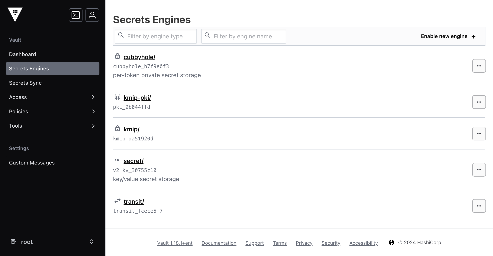

# HashiCorp Vault installation
To deploy HashiCorp Vault you only need to start the VM.
```
cd hashicorp
vagrant up
```
A VM will be deployed with Vault 1.17.5. You can easyly change in this [config.sh](./config/config.sh) file.
# HashiCorp Vault console
- Console: [http://127.0.0.1:8200](http://127.0.0.1:8200)
- Token: root


# HashiCorp Vault config
In this VM you will have:
- Vault server
- Enable vault transit
- Write a vault key
# Destroy HashiCorp Vault VM
```
cd hashicorp
vagrant destroy -f
```